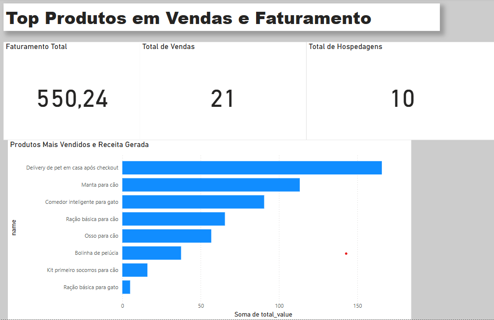

# 📊 Análise Financeira com Power BI  

Este projeto apresenta uma análise detalhada de dados financeiros utilizando **Power BI**, proporcionando insights valiosos para tomada de decisão.  

## 🔎 Objetivo  

O objetivo deste dashboard é fornecer uma visão clara sobre **receitas, despesas e tendências financeiras**, ajudando na gestão e planejamento estratégico.  

## 📌 Tecnologias Utilizadas  

- **Power BI** para criação do dashboard  
- **Excel / CSV** como fonte de dados  
- **DAX e Power Query** para transformação dos dados  

## 📈 Visualização  

Aqui está um exemplo do **gráfico gerado no Power BI**:  

  

## 🚀 Como Utilizar  

1. Baixe o arquivo **.pbix** do Power BI neste repositório  
2. Abra no Power BI Desktop  
3. Explore os gráficos interativos e filtre os dados conforme necessário  

## 📢 Contato  

💼 [LinkedIn](https://www.linkedin.com/in/jos%C3%A9-wesley-782ba71a8/)  
📊 [GitHub](https://github.com/wesjoley)  

📌 **Autor:** José Wesley  

---
🚀 **Transformando dados em decisões estratégicas!**

